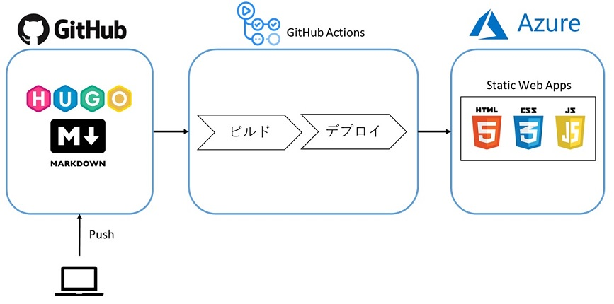

## About This Site
このサイトは、Hugo、Azure Static Webapp、Github Actionで作成されています。
(詳細はページ下段参照)
https://github.com/tagfa/portfolio

## About Me
コードが書けるインフラエンジニア。
1992年生まれの社会人歴6年目。
新卒で金融グループのIT企業に入社。

入社1～2年目は基幹システム(Webアプリケーション)担当として、主にバックエンドロジック改修等に従事。

3年目にインフラ部門へ移動となり、主にオンプレミスのクラウド基盤運用、AWS開発環境運用を担当。

近年では、構成管理・自動化ツールであるAnsibleの導入も担当。

https://github.com/tagfa

## Qualification
- 基本情報技術者
- 応用情報技術者
- 情報セキュリティスペシャリスト
- Azure Fundamental
- Azure Administrator Assosiate

## 自主制作物
### 1.自身のポートフォリオサイト(このサイト)
#### 狙い
- Azureを用いたWebサイトホスティング
- CI/CDの基礎となる自動ビルド、自動デプロイの学習

#### 採用技術
- Azure(Azure Static Web Apps)
- Hugo
- GitHub Actions

### 2.S3を用いた写真掲載サイト
URL：
http://tagfaphotoviewer.net/ 

#### 狙い
- AWSで複数サービスを組み合わせたWebサイト作成
- フロントエンド基礎の学習

#### 採用技術
- AWS(EC2,S3,Cognito,Route53)
- HTML,CSS,JavaScript

#### 処理フロー
①HTTPアクセス

- Route53でFQDNの名前解決し、Webサーバ(Nginxが稼働)にアクセス

②認証情報取得

- CognitoのIDプールを作成し、S3の特定のBucketにのみアクセス可能なIAMを付与

③画像ファイルDL

- ②で作成したIDでS3へアクセス。画像を取得。

## Development Skills





- Ansible
- Azure
